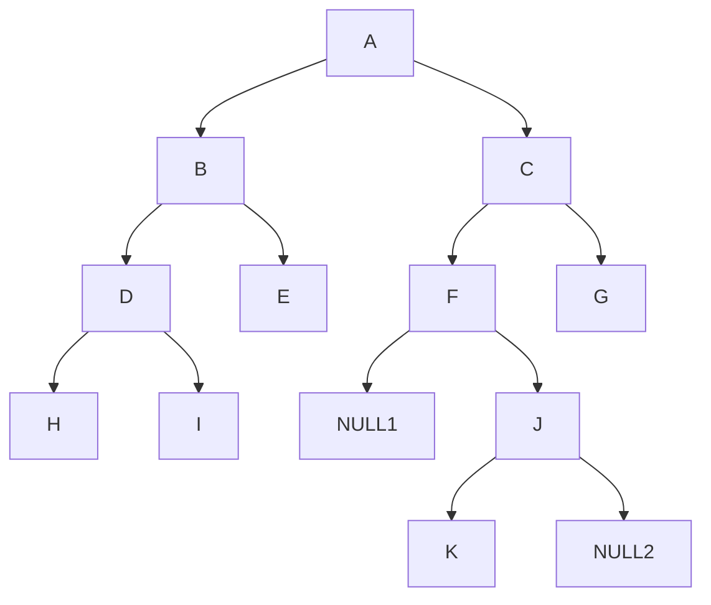

## Define a binary search tree
Binary Search Tree(BST): the element in the left side is smaller than or equal to the elements in the right side of the tree.

Recurstion is very popular here for binary search tree definition and its implementation.

```cpp
struct bstNode {
  int data;
  bstNode* left;
  bstNode* right;
}
```

## Insert an element

```cpp
bstNode* getNewNode(int data){
  bstNode* newNode = new bstNode();
  newNode->data = data;
  newNode->left = NULL;
  newNode->right = NULL;
  return newNode;
}
bstNode* Insert(bstNode* root, int data) {
  if(root == NULL) {
    root = getNewNode(int data);
  }
  else if(data <= root->left) {
    root->left = Insert(root->left, data);
  }
  else {
    root->right = Insert(root->right, data);
  }
  return root;
}
```

## Traverse

### level order

```cpp
void levelOrder(bstNode* root) {
  if(root == NULL) return;
  queue<bstNode*> q;
  q.push(root);
  while(!q.empty()) {
    bstNode* current = q.front();
    cout << current->data << " ";
    if(current->left != NULL) q.push(current->left);
    if(current->right != NULL) q.push(current->right);
    q.pop();
  }
}
```

### pre-order

Pre-order is `node->data/node->left/node->right`

`A->B->D->H->I->E->C->F->J->K->G`


```cpp
void preOrder(bstNode* root) {
    if(root == NULL) return;
    cout << root->data << " ";
    preOrder(root->left);
    preOrder(root->right);
}
```

### in-order

In-order is `node->left/node->data/node->right`

`H->D->I->B->E->A->F->K->J->G->C`

```cpp
void inOrder(bstNode* root) {
    if(root == NULL) return;
    inOrder(root->left);
    cout << root->data << " ";
    inOrder(root->right);
}
```

### post-order

```cpp
void postOrder(bstNode* root) {
    if(root == NULL) return;
    postOrder(root->left);
    postOrder(root->right);
    cout << root->data << " ";
}
```

## Search

```cpp
int Search(bstNode* root, int data) {
  if(root == NULL) return false;
  else if(data == roo->data) return true;
  else if(data <= root->data) return Search(root->left, data);
  else return Search(root->right, data);
}
```

## Find maximum and find minimum

```cpp
int findMax(bstNode* root) {
    if(root == NULL) return -1;
    bstNode* current = root;
    while(current->right != NULL) {
        current = current->right;
    }
    return current->data;
}

int findMin(bstNode* root) {
    if(root == NULL) return -1;
    bstNode* current = root;
    while(current->left != NULL) {
        current = current->left;
    }
    return current->data;
}
```

## Find height

```cpp
int findHeight(bstNode* root) {
  if(root == NULL) return -1;
  int leftHeight = findHeight(root->left);
  int rightHeight = findHeight(root->right);
  return max(leftHeight,rightHeight)+1;
}
```

