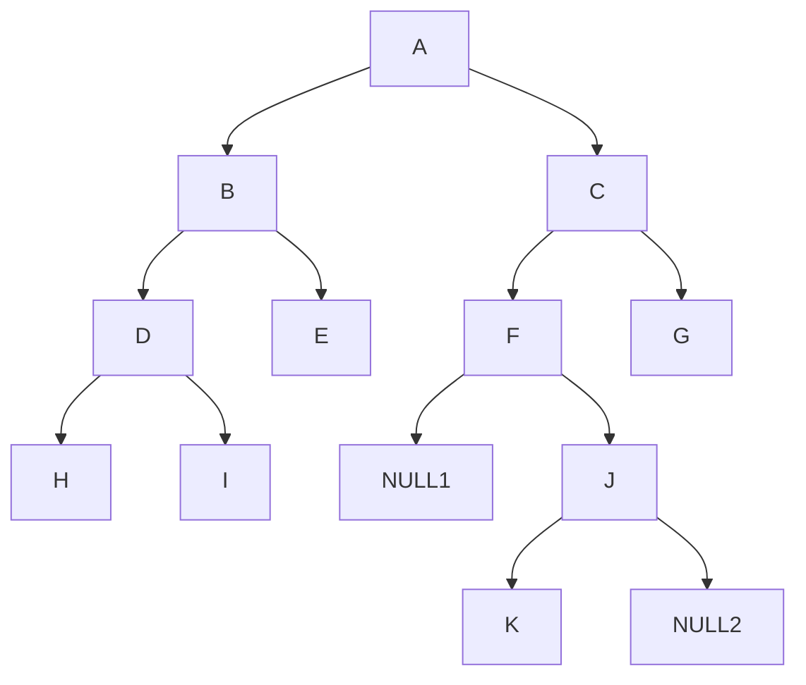
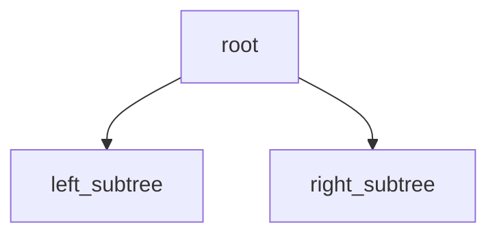
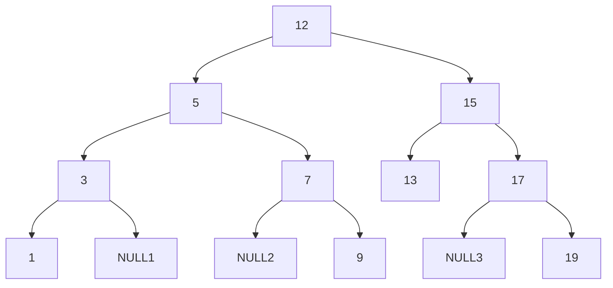

[Define a binary search tree](#define-a-binary-search-tree)

[Insert an element](#insert-an-element)

[Traverse](#traverse)

  * [level order](#level-order)
  * [pre-order](#pre-order)
  * [in-order](#in-order)
  * [post-order](#post-order)

[Search](#search)

[Find maximum and minimum](#find-maximum-and-find-minimum)

[Find height](#find-height)

[Check binary tree](#check-if-a-binary-tree-is-a-binary-search-tree)

[Delete a node from bst](#delete-a-node-from-bst)

[Inorder successor in a BST](#inorder-successor-in-a-bst)

## Define a binary search tree
Binary Search Tree(BST): the element in the left side is smaller than or equal to the elements in the right side of the tree.

Recurstion is very popular here for binary search tree definition and its implementation.

```cpp
struct bstNode {
  int data;
  bstNode* left;
  bstNode* right;
}
```

## Insert an element

```cpp
bstNode* getNewNode(int data){
  bstNode* newNode = new bstNode();
  newNode->data = data;
  newNode->left = NULL;
  newNode->right = NULL;
  return newNode;
}
bstNode* Insert(bstNode* root, int data) {
  if(root == NULL) {
    root = getNewNode(int data);
  }
  else if(data <= root->left) {
    root->left = Insert(root->left, data);
  }
  else {
    root->right = Insert(root->right, data);
  }
  return root;
}
```

## Traverse

### level order

```cpp
void levelOrder(bstNode* root) {
  if(root == NULL) return;
  queue<bstNode*> q;
  q.push(root);
  while(!q.empty()) {
    bstNode* current = q.front();
    cout << current->data << " ";
    if(current->left != NULL) q.push(current->left);
    if(current->right != NULL) q.push(current->right);
    q.pop();
  }
}
```

### pre-order

Pre-order is `node->data/node->left/node->right`

`A->B->D->H->I->E->C->F->J->K->G`


```cpp
void preOrder(bstNode* root) {
    if(root == NULL) return;
    cout << root->data << " ";
    preOrder(root->left);
    preOrder(root->right);
}
```

### in-order

In-order is `node->left/node->data/node->right`

`H->D->I->B->E->A->F->K->J->G->C`

```cpp
void inOrder(bstNode* root) {
    if(root == NULL) return;
    inOrder(root->left);
    cout << root->data << " ";
    inOrder(root->right);
}
```

### post-order

```cpp
void postOrder(bstNode* root) {
    if(root == NULL) return;
    postOrder(root->left);
    postOrder(root->right);
    cout << root->data << " ";
}
```

## Search

```cpp
int Search(bstNode* root, int data) {
  if(root == NULL) return false;
  else if(data == roo->data) return true;
  else if(data <= root->data) return Search(root->left, data);
  else return Search(root->right, data);
}
```

## Find maximum and find minimum

```cpp
int findMax(bstNode* root) {
    if(root == NULL) return -1;
    bstNode* current = root;
    while(current->right != NULL) {
        current = current->right;
    }
    return current->data;
}

int findMin(bstNode* root) {
    if(root == NULL) return -1;
    bstNode* current = root;
    while(current->left != NULL) {
        current = current->left;
    }
    return current->data;
}
```

## Find height

```cpp
int findHeight(bstNode* root) {
  if(root == NULL) return -1;
  int leftHeight = findHeight(root->left);
  int rightHeight = findHeight(root->right);
  return max(leftHeight,rightHeight)+1;
}
```

## Check if a binary tree is a binary search tree



`left_subtree->data < root->data < right_subtree->data`

```cpp
int iSL(bstNode* root, val) {
 	if(root == NULL) return true;
  else if(root->left <= val && iSL(root->left, val) && iSL(root->right, val)) return true;
  else return false;
}
int iSG(bstNode* root, val) {
  if(root == NULL) return true;
  else if(root->right > val && iSG(root->left, val) && iSG(root->right, val)) return true;
  else return false;
}
int isBST(bstNode* root) {
  if(root == NULL) return true;
  else if(iSL(root->left, root->data) && iSG(root->right, root->data) && isBST(root->left) && isBST(root->right)) return true;
  else return false;
}
```

## Delete a node from BST



```cpp
bstNode* Delete(bstNode* root, int data) {
    if(root == NULL) return root;
    else if(data < root->data) root->left = Delete(root->left, data);
    else if(data > root->data) root->right = Delete(root->right, data);
    else {
        if(root->left == NULL && root->right == NULL) {
            delete(root);
            root = NULL;
        }
        else if(root->left == NULL) {
            bstNode* temp = root;
            root = root->right;
            delete(temp);
        }
        else if(root->right == NULL) {
            bstNode* temp = root;
            root = root->left;
            delete(temp);
        }
        else {
            bstNode* temp = findMin(root->right);
            root->data = temp->data;
            root->right = Delete(root->right, temp->data);
        }
    }
    return root;
}
```

## Inorder successor in a BST

case 1: Node has right subtree --> find the min in right subtree

case 2: No right subtree --> the nearest ancestor for which given node would be in left subtree

```cpp
bstNode* getSuccessor(bstNode* root, int data) {
	bstNode* current = Find(root, data);
  if(current == NULL) return NULL;
  if(current->right != NULL) {
    return findMin(current->right);
  }
  else {
    bstNode* successor = NULL;
    bstNode* ancestor = root;
    while(ancestor != current) {
      if(current->data < ancestor->data) {
        successor = ancestor;
        ancestor = ancestor->left;
      }
      else {
        ancestor = ancestor->right;
      }
    }
    return successor;
  }
}
```


